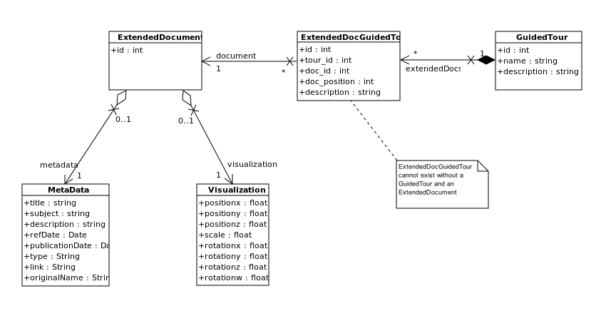
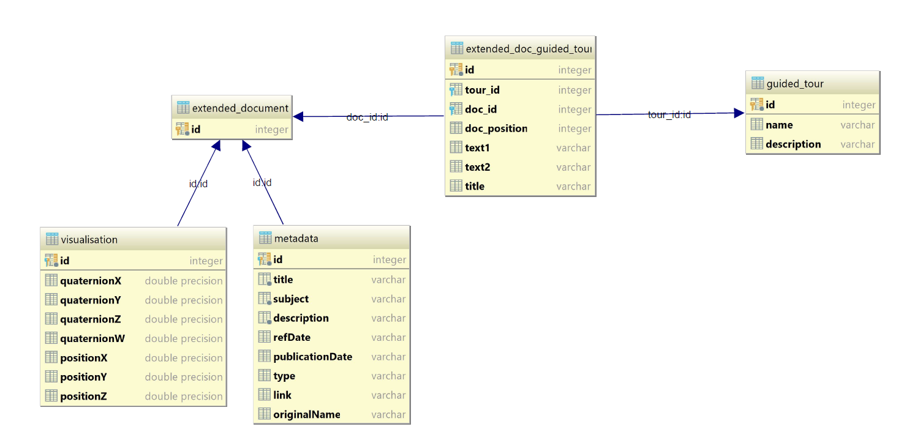

# Description of the API Enhanced Document application

# Introduction

The goal of the API **Enhanced Document** is to handle documents needed from the front-end in [UDV](https://github.com/MEPP-team/UDV).

It achieves all the [CRUD operations](https://en.wikipedia.org/wiki/Create,_read,_update_and_delete) on the backend side.
API Document (AED) is developed in python and is based on an **MVC** (Model, View, Controller) architecture.
Persistance of objects (documents) to the DataBase is obtained through the usage of the [sqlalchemy library](https://www.sqlalchemy.org) [**ORM**](https://en.wikipedia.org/wiki/Object-relational_mapping).
In order to wrap the (CRUD) service within an HTTP protocol (to deal with the requests and send responses to the client), AED uses the [flask library](http://flask.pocoo.org/docs/1.0/).


**ExtendedDocument** is an object, that correspond to a (raw) document (e.g. a picture, a map, a graphic) associated with some metadata and other visualization data.
The ability to attach Extended Documents (and more generally information) to city objects is a key feature of UDV. The API Extended Document (AED) application (acting on the backend side) thus offers to create, read, update and delete Extended Documents.
On top of that, in order to respond to the 
[need 07](https://github.com/MEPP-team/RICT/blob/87610d01d87f5c6dfc2873c28de59b06b33aa31f/Doc/Devel/Needs/Need007.md)
and the [need 25](https://github.com/MEPP-team/RICT/blob/87610d01d87f5c6dfc2873c28de59b06b33aa31f/Doc/Devel/Needs/Need025.md), 
we have also the possibility to attach an **ExtendedDocument** to one or several **Guided Tours**.

You can find below the the class diagram of an Extended Document as used within the API Extended Document (AED) application: 


In addition, you can find the database diagram, used in relation with the class diagram:  

*Note: This diagram was automatically create using [DataGrip](https://www.jetbrains.com/datagrip/) developed by JetBrains.*

The sources of the API Extended Document application can be found on the [UDV sever git repository](.)

## MVC Architecture
The AED application uses an [Model View Controller (MVC)](https://en.wikipedia.org/wiki/Model%E2%80%93view%E2%80%93controller) architecture that is described in this chapter.

### Model (entity)
A (UDV oriented) document is composed of two main parts :
- the **MetaData** of the document such as having a title, a description, etc.
- the **Visualisation** data that can allow e.g. to display the document   at a specified spatial position when realising a rendering of a City.

In order to relate (link) those two parts, the MetaData and the Visualisation classes, AED uses a third entity called **ExtendedDocument**.

On top of ExtendedDocument, AED implements the notion of **GuidedTour**. Because the relationship between **ExtendedDocument** and **GuidedTour** is a Many to Many type, AED defines the **ExtendeDocGuideTour** class. **ExtendeDocGuideTour** can link a document to a GuidedTour. Note that an ExtendedDocument can be associated several times to the same guided tour. Since a Guided Tour has a beginning and an end, the notion or order is thus important, and we hence have the attribute **doc_position**, that defines the order of each document in the guided tour.


### Controller
The controller is used to interact with the entities. It can realize all the CRUD (Create, Read, Update, Delete) operations.

### View
The view is a sort of interface between a human and the application.
By following the human's action the view informs the controller which will make some operations in response.
In the application, the view is called **web_api.py** and can intercept web requests and send response to them.

## ORM (Object Relational Mapping)

### Description
ORM is a way to crate a strong interaction between objects that should be persisted and a DataBase (DB) : when an object is modified, the modification can be easily persisted to the DB without the need to write any SQL request.
Such a feature can reduce the complexity of the code since it offers to increase its abstraction level by making it independent from the particular technology of the chosen concrete DB (postgreSQL, Oracle, MySQL...).

### How to?
**How can we share inheritance or foreign key notion between an object and a DB ?**

Although the implementation is not required to write sql requests, it still needs to indicate the relationship between the DB and the object directly in their python code.
For that we use the [sqlalchemy library](htps://www.sqlalchemy.org) that in turn uses the [psycorpg2](http://initd.org/psycopg/docs/) (as an adapter/connector) to communicate with the PostgreSQL DataBase.

We tried to make a [résumé](entities/README.md) of what we use from SQLAlchemy, however a lot of things are not broached and can be found 
[here](http://docs.sqlalchemy.org/en/latest/orm/tutorial.html).

## Web Application

### Flask

[flask](http://flask.pocoo.org/docs/1.0/) is a micro web framework developped in python. This framework allows us to interpret HTTP request (mainly GET and POST methods) and send appropriate response to the client.
Some complementary information (concerning the Flask part of the ADE application) is available in 
the [api folder](api/README.md).
Moreover, you can find a tutorial [here](http://flask.pocoo.org/docs/1.0/quickstart/#a-minimal-application).

## Other directories

**log**
This directory collects some information of what happens during the execution of the application :
- **info.log** : information about the global application execution
- **sqlalchemy.log** : operations between the DB and python

**persistence_unit**
This directory contains some methods to facilitate the interaction between the DB and the python objects and reduce lines of code when persisting objects.

**test**
The test directory is used to make tests, in order to assert that the application works well.

**db_config**
This directory global script and file to configure the application

**config.yml**
This file is used to specify information about the database. In order to use the **yml** format we use the python library named [PyYAML](https://pyyaml.org/wiki/PyYAMLDocumentation). The `config.yml` file has the following form:

```
ordbms: <type of DB>
user: <use of the DB>
password: <user password>
host: <server hosting the db>
port: <port of the server>
dbname: <name of the database>
```

**log.py**
Defines the configuration of the logger of the ADE application

**db_config.py**
Configures the application by using the *config.yml* file.

# Other documentations

- **How to use the API**
You can find [here](doc/API-Documentation.md) the documentation of the API which describes mainly the routes to commuicate with the server.

- **Installation**
To install the application both on UNIX and Windows, go to this [file](INSTALL.md).

- **Decorator**
We use several times decortors in the application, in order to simplify the code and make it more readable. However it is not a very obvious thing to understand, that is why we made a [tutorial](doc/Decorators.md) to understand what it is and how we use them.

- **Diagram**
The diagram were mostly made with [Visual Paradigm](https://visual-paradigm.com/), for further information on how you can modify them, go [there](doc/Class-diagrams.md).
