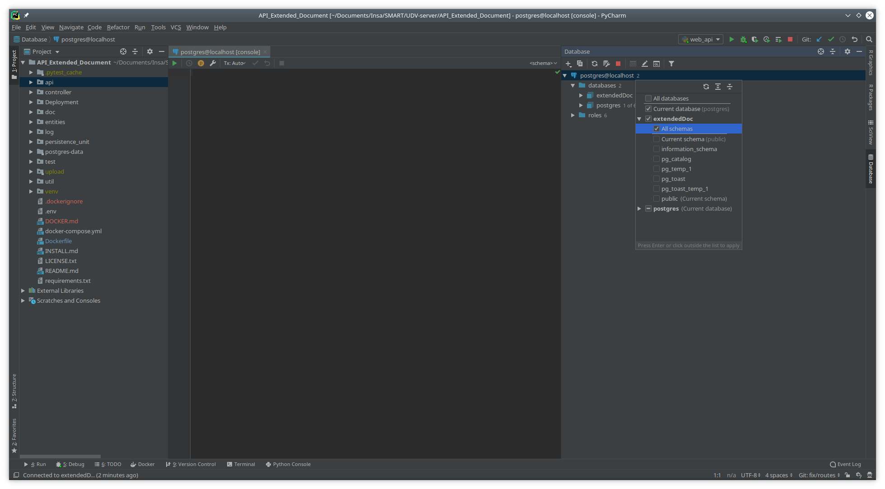
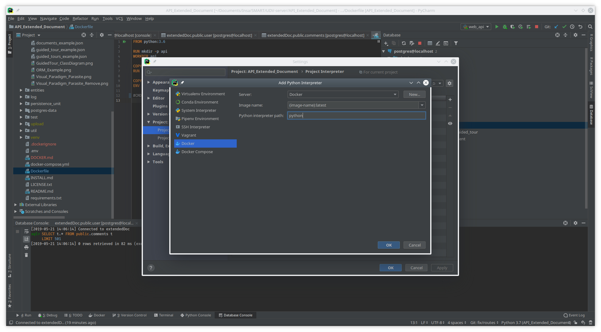
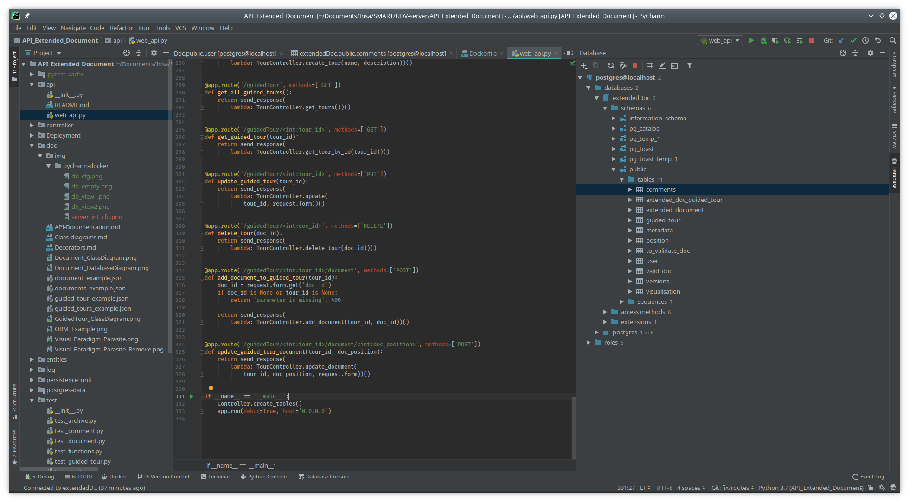
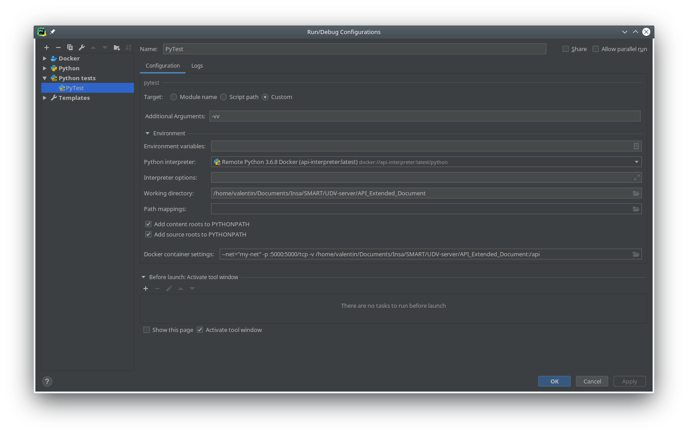

# Setup PyCharm Debugging

The goal of this document is to explain how to setup a docker environment without using docker-compose, allowing to debug through IDEs like PyCharm.

## Overview

The easiest way to setup the Extended Doc API is through docker-compose, which manages the two containers automatically. But it doesn't allow (or I didn't found how) to debug the application within an IDE like PyCharm (with functionning breakpoints and other debug functionnalities). So, in order to properly debug our application, we need to change our docker setup a bit. The first part of this document explains how to manually setup a docker environment which doesn't use docker-compose. The second part explain how to configure PyCharm to run the server in a docker image, allowing us to debug it.

## Docker setup

### User permission

If you do not have user permissions to use docker (ie. if you need to add `sudo` in front of every docker command), you just need to add your user to the `docker` group. On linux, it can easily be done with the commande :

```
$ usermod -a -G docker {username}
```

> Please note that you will need to restart the current shell session to notice the changes. If docker was already launched at this moment, rebooting the machine is the simpler way to apply the changes.

### Bridge setup

As we need two docker containers to communicate, we first need to create a bridge network. It is a basic feature of Docker which allows containers to use an isolated network, and only communicate with containers on that network. The creation of a bridge is pretty simple :

```
$ docker network create {network-name}
```

> {network-name} is a string representing the name of the network, you are free to choose any name that doesn't exist. Note that the names `bridge` and `host` are reserved by docker. You can see the existing networks with the command `docker network ls`.

### Running the database

Now that our network is in place, we can create the container which runs the database. We do not need to create an image first, because we can just fetch an existing Postgres image. However, we need to pass some arguments for the configuration to work. The following command runs the container :

```
$ docker run --restart always --name postgres -e POSTGRES_USER=postgres -e POSTGRES_PASSWORD=password -e POSTGRES_DB=extendedDoc -v `pwd`/postgres-data/postgres:/var/lib/postgresql/data --network {network-name} -p 5432:5432 postgres:10
```

> Replace {network-name} by the name of the network you chose before.

> As we use the `pwd` command to specify the current directory, you need to be in the `API_Extended_Doc` folder when running it.

If you get an error saying that the container already exists, it may be because you already launched the database. In this case, just check that the container 'postgres' is running by listing the containers : `docker container ls`. If you see the `postgres` container, the database is launched. If not, you can run  it using the command `docker start postgres`.

Now that the database is launched, you should be able to query it by connecting to `localhost:5432` with a PostgreSQL explorer. PyCharm for example allows you to do that pretty easily :

#### Exploring the data with PyCharm

In the right toolbar of PyCharm editor, you should see a "Database" menu. Click on it to open the Database window. Currently, no data source is configured.


The first step is to configure a new data source. Click on the "+" in the top-left of the Database window and choose "Data Source > PostgreSQL". It will open a configuration window. Fill the fields as in the screenshot below.


You can now test the connection. Fill in the database password (which is normally "password", see the .env file) and it should successfully connect. You should be able to see the data source in the Database window, and if you expand the "database" folder you should see an "extendedDoc" database. If that's not the case, just click on the number right to the data source an check the "extendedDoc" checkbox.




You can now view the content of each table by double-clicking on them. If that's the first time you run the database, every table should be empty, but they will be filled with data when we'll run the server.

## Running the server inside a Docker from PyCharm

Now that the database is correctly launched inside the 'postgres' container, we should be able to run a docker container with the server inside to debug it. PyCharm can do that by changing the Python interpreter, and specifying that we want to run the server inside a Docker. But before that, we need to create the corresponding Docker image.

### Creating the server docker image

Whereas we could fetch the database image from internet, the server image is a custom image that we made, so we have to build it before running the container. The Dockerfile provided in the API_Extended_Document folder setups the correct environment, however it launches the server at the end (with the line `CMD python api/web_api.py`). That's not what we whant because PyCharm will try to launch the application itself, and it will somehow result in a conflict. So, we just need to comment the line :

```dockerfile
# CMD python api/web_api.py
```

Now we can build our image with the following line :

```
$ docker build -t {image-name} .
```

> {image-name} can be whatever name you want, but we recommend not to name it `extended_document_api` because this name is the one used by docker compose. If you want to run the server with the docker-compose method after following this tutorial, it will be easier if the names don't conflict.

### Creating the PyCharm Python Interpreter

Now we need to create a PyCharm interpreter using that image. Type `Ctrl-Alt-S` to open the settings, and go to "Project: [...] > Project Interpreter". Click on the cog icon in the right of the window and select "Add". It will open a configuration window to setup our new interpreter. Select the "Docker" option and fill the fields. The server should be automatically detected, otherwise it could be that you do not have the rights as a user to access the Docker daemon (see the "User permission" section of this file). Select your docker image that you juste created, and leave the last field as is.



### Run/Debug configuration

The last step is to configure a main file to run on the server. To do that, we need to go in the `api/web_api.py` file and go to the bottom. Left to the main section of the code, PyCharm displays a green triangle to run the code from here. If you click on it, it will create a run configuration that we can see in the upper left section of the window.



You can now click on the created configuration and select "Edit Configuration". We need to change some settings here :

1. The interpreter should be set to the Docker interpreter that we just created. Select it in the dropdown list.
2. The working directory should be the `API_Extended_Document` folder.
3. We should configure the Docker container. You can click on the folder icon right to the "Docker container settings" field to access a configuration panel. We need to set the network to {network-name}, publish the 5000 port and configure add a volume binding. You can see an example configuration below.


> In this example, my {network-name} is "my-net".

### Running the server

Now you should be able ton run the `web_api`. You can click on the green arrow right to the run configuration, or hit `Maj-F10`. The server should be running and exposing the port 5000.

## Launching PyTest inside a Docker from PyCharm

PyCharm provides built-in support for all sorts of testing frameworks in Python. As the project already uses Pytest, which is a really simple and convenient framework, it would be useful to launch them from PyCharm.

### Creating a Test configuration

We must create a test configuration, like we made a run/debug configuration for the `web_api.py` file. To do that, we can go into the "Edit Configuration" window and click on the "+" icon. Select the "Python Tests > pytest" option and we can start configuring the settings.

1. The target will be a custom target. In order to have all informations about the test results, we specify the '-vv' additional argument.
2. The python interpreter is the same as before.
3. The working directory should still be `API_Extended_Document`
4. The container settings should be the same as in the previous section.

The configuration window should look like this :



And that's done ! You should be able to run PyTest without problems now. Just hit the green arrow and the tests will run properly.