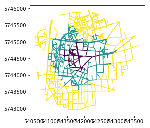

# Get accessible parks from each buildings of a specific area

> This work is partially based on studies and code presented in this french [article](https://projet.liris.cnrs.fr/mi2/posts/2019/02/22/isochrone-exploration-part2.html) and this [notebook](https://nbviewer.jupyter.org/github/sical/app_iso/blob/iso_design/code/experiments/Isochrones_blog.ipynb) and [GitHub repository](https://github.com/sical/app_iso/tree/iso_design).

> http://kuanbutts.com/2017/12/16/osmnx-isochrones/

> https://github.com/gboeing/osmnx-examples/blob/master/notebooks/13-isolines-isochrones.ipynb

> ***WARNING***: We get points with EPSG:4326 projection. We use EPSG:3857 for visualisation purposes, so we reproject points. For distance measures we need to reproject points into a metric projection, so we use - for our use case in metropolitan France - the EPSG:2154.

## Theoric method

1. Get polygon of a park and walkable network
2. Buffering the polygon
3. Get the nearest network nodes
4. Make isochrones from these nodes
5. Get reachables nodes and edges
6. Buffering edges
7. Get buildings that intersect with buffered edges/lines

<figure>
  
  <figcaption><i>IMU Labex, Canopy, T. Leysens, 2019</i></figcaption>
</figure>

## First test: accessibility from one point

> Chosen point: [Nautibus building](https://www.openstreetmap.org/search?whereami=1&query=45.78221%2C4.86570#map=19/45.78221/4.86570), 45.78221, 4.8657

We need to get a graph in order to measure walkable accessibility from one or multiple points. To get it, we are going to use the [OSMnx Python library](https://github.com/gboeing/osmnx) through our own classes and methods.

Getting the graph can cost a lot of time, so it is recommended to get it once and write it on disk.

### Get the walkable network, transform it to NetworkX MultiDiGraph and save it to disk

> Import [osmnx](https://github.com/gboeing/osmnx) and our own Python methods (*based - among others - on [NetworkX](https://github.com/networkx/networkx) and [Shapely](https://github.com/Toblerity/Shapely)*)

* Get the walkable network
* Set a time by edge as weight, based on walk speed (*in meters/hour*, here we set it to 5000m)
* Write a JSON nodes file and a JSON edges file


```python
import osmnx as ox

from graph_utils import graph_to_df, graph_with_time

# Parameters
origin = 45.78221, 4.8657
center_graph = 4.8527, 45.7569

bbox = [4.83,45.75,4.9,45.8] #from Geofabrik Tile Calculator, [left, bottom, right, top]

# Get graph from OSM data
graph = ox.graph_from_bbox(
    bbox[3],
    bbox[1],
    bbox[2],
    bbox[0],
    network_type="walk"
) #bbox => north, south, east, west

# Add time as weight in graph (based on walk speed)
walk_distance = 5000 #in meters for 1 hour trip
graph = graph_with_time(graph, walk_distance)

#Write graph to disk as 2 files (nodes and edges)
nodes_path = "./data/graph/nodes.json"
edges_path = "./data/graph/edges.json"
graph_to_df(graph, edges_path, nodes_path)
```

### Get graph from JSON files

> Import JSON nodes and edges files to get a NetworkX MultiDiGraph


```python
from graph_utils import df_to_graph

# Import graph from json files and transform to NetworkX MultiDiGraph
nodes_path = "./data/graph/nodes.json"
edges_path = "./data/graph/edges.json"
G = df_to_graph(edges_path, nodes_path)
```

### Measure accessibility from the origin

> Based on our own Python class *Accessibility* based on:
>* [GeoPandas](https://github.com/geopandas/geopandas)
>* [NetworkX](https://github.com/networkx/networkx)
>* [Osmnx](https://github.com/gboeing/osmnx)
>* [Shapely](https://github.com/Toblerity/Shapely)
>* [Numpy](https://github.com/numpy/numpy)
>* [Bokeh](https://github.com/bokeh/bokeh)

* Get walkable accessibility from/to chosen point:
    * set a list of origin points (*for now, we just use one origin*)
    * set trip times (*list pf trip durations in minutes*)
    * set buffer for the buffering of isolines
    * set the graph to use
    * set the color palette or use default (*Bokeh Viridis palette*)
    * set the origin, metric and visualisation (*origin, metric, vis*) dictionary or use default:
        * ```python
          epsgs={
                    "origin":"4326",
                    "metric":"2154",
                    "vis":"3857"
                    }
          ```
        * => metric EPSG is needed to measure buffers in meters, origin EPSG is needed to set the default and visualisation is needed to get elements set for webmapping (*example: EPSG 3857*)

* Returns:
    * Isolines:
        * object.lines.origin => isolines with origin EPSG
        * object.lines.metric => isolines with metric EPSG
        * object.lines.vis => isolines with visualisation EPSG
    * Buffered isolines:
        * object.buffered.origin => buffered isolines with origin EPSG
        * object.buffered.metric => buffered isolines with metric EPSG
        * object.buffered.vis => buffered isolines with visualisation EPSG
    * Union of buffered isolines by duration:
        * object.union.origin => union of buffered isolines with origin EPSG
        * object.union.metric => union of buffered isolines with metric EPSG
        * object.union.vis => union of buffered isolines with visualisation EPSG


```python
from isochrone import Accessibility

# Parameters
origin = 4.8657, 45.78221

pts = [origin]
trip_times = [5, 10, 15] #in minutes
distance_buffer = 20 #in meters

access = Accessibility(G, trip_times, distance_buffer, pts=pts)
access.get_results()
```

    /home/thomas/Documents/Canopy/UseCases/WalkablePark/isochrone.py:196: SettingWithCopyWarning:
    A value is trying to be set on a copy of a slice from a DataFrame

    See the caveats in the documentation: http://pandas.pydata.org/pandas-docs/stable/indexing.html#indexing-view-versus-copy
      inplace=True


### Explore GeoDataframe: *example of Buffered isolines GeoDataFrame*


```python
access.buffered.metric.head()
```


<div>
<style scoped>
    .dataframe tbody tr th:only-of-type {
        vertical-align: middle;
    }

    .dataframe tbody tr th {
        vertical-align: top;
    }

    .dataframe thead th {
        text-align: right;
    }
</style>
<table border="1" class="dataframe">
  <thead>
    <tr style="text-align: right;">
      <th></th>
      <th>source</th>
      <th>target</th>
      <th>color</th>
      <th>duration</th>
      <th>geometry</th>
    </tr>
  </thead>
  <tbody>
    <tr>
      <th>0</th>
      <td>205317120</td>
      <td>1420932342</td>
      <td>#440154</td>
      <td>5</td>
      <td>POLYGON ((542094.00012589 5745465.78899049, 54...</td>
    </tr>
    <tr>
      <th>1</th>
      <td>205317120</td>
      <td>3252041041</td>
      <td>#440154</td>
      <td>5</td>
      <td>POLYGON ((541918.1482176075 5745358.396861196,...</td>
    </tr>
    <tr>
      <th>2</th>
      <td>205317120</td>
      <td>3252041040</td>
      <td>#440154</td>
      <td>5</td>
      <td>POLYGON ((542020.6621466505 5745390.710668872,...</td>
    </tr>
    <tr>
      <th>3</th>
      <td>243757854</td>
      <td>205317120</td>
      <td>#440154</td>
      <td>5</td>
      <td>POLYGON ((542011.6449149937 5745418.613872125,...</td>
    </tr>
    <tr>
      <th>4</th>
      <td>1425253380</td>
      <td>1421018199</td>
      <td>#440154</td>
      <td>5</td>
      <td>POLYGON ((541824.7895604683 5745497.983474411,...</td>
    </tr>
  </tbody>
</table>
</div>


### Visualise results by simple plot: examples of isolines


```python
access.lines.origin.plot(column='duration', cmap='viridis');
```


### Visualise results with webmapping (*with Bokeh Python library*)

* Save GeoDataframe as GeoJSONs
* Import them as Bokeh GeoJSONSource
* Plot them in webmapping app

> ***Warning: Bokeh Patches does not support holes in polygons so Union layer may show full polygons even if GeoJSON polygons do have holes***  

> ***We use a PNG image file for the markdown version of this Notebook. For dynamic and interactive webmapping version, see the ```accessibility_map.html``` or use the Jupyter Notebook.***


```python
from bokeh.io import show, output_file, output_notebook
from bokeh.models import GeoJSONDataSource, ColorBar, LogColorMapper, LogTicker, ColumnDataSource
from bokeh.plotting import figure
from bokeh.tile_providers import get_provider, Vendors
from bokeh.io import export_png
from bokeh.layouts import gridplot
from bokeh.palettes import Viridis3
from bokeh.transform import linear_cmap
import json

output_notebook()

lines_name = "./data/lines.geojson"
buffered_name = "./data/buffered.geojson"
union_name = "./data/union.geojson"

# Save GeoDataframe as GeoJSON
access.lines.vis.to_file(lines_name, driver="GeoJSON")
access.buffered.vis.to_file(buffered_name, driver="GeoJSON")
access.union.vis.to_file(union_name, driver="GeoJSON")

# Open GeoJSON as GeoDataSources for Bokeh webmapping
with open(lines_name) as f:
    d = json.load(f)
    lines_source = GeoJSONDataSource(
        geojson=json.dumps(d)
    )

with open(buffered_name) as f:
    d = json.load(f)
    buffered_source = GeoJSONDataSource(
        geojson=json.dumps(d)
    )

with open(union_name) as f:
    d = json.load(f)
    union_source = GeoJSONDataSource(
        geojson=json.dumps(d)
    )

# Create color mapper
mapper = linear_cmap(
    field_name='duration',
    palette=Viridis3,
    low=0.1,
    high=15
)

# Create Bokeh figures
p1 = figure(
        width = 400,
        height = 300,
        output_backend="webgl"
    )
p2 = figure(
        width = 400,
        height = 300,
        output_backend="webgl",
        x_range = p1.x_range,
        y_range = p1.y_range
    )
p3 = figure(
        width = 400,
        height = 300,
        output_backend="webgl",
        x_range = p1.x_range,
        y_range = p1.y_range
    )

# Add background tiles
p1.add_tile(get_provider(Vendors.STAMEN_TONER_BACKGROUND), alpha=0.2)
p2.add_tile(get_provider(Vendors.STAMEN_TONER_BACKGROUND), alpha=0.2)
p3.add_tile(get_provider(Vendors.STAMEN_TONER_BACKGROUND), alpha=0.2)

# Add lines
p1.multi_line(
    xs="xs",
    ys="ys",
    line_color=mapper,
    line_alpha=1,
    line_width=3,
    source=lines_source,
    legend="Lines"
)

# # Add buffered lines
p2.patches(
    xs="xs",
    ys="ys",
    fill_color=mapper,
    fill_alpha=0.5,
    line_color="white",
    line_alpha=0.5,
    line_width=1,
    source=buffered_source,
    legend="Buffered Lines"
)

# Add union of buffered lines
p3.patches(
    xs="xs",
    ys="ys",
    fill_color=mapper,
    fill_alpha=0.5,
    line_color="white",
    line_alpha=0.5,
    line_width=1,
    source=union_source,
    legend="Union"
)

# Create origin point
origin = ColumnDataSource(
    data=dict(
        x= [541647.25],
        y= [5745516.65],
        size = [10],
        color = ["red"],
        line_color = ["white"],
        line_width = [2]
    )
)

p1.circle(
    x="x",
    y="y",
    color="color",
    size="size",
    line_color="line_color",
    line_width="line_width",
    source=origin,
    legend="Origin"
)
p2.circle(
    x="x",
    y="y",
    color="color",
    size="size",
    line_color="line_color",
    line_width="line_width",
    source=origin,
    legend="Origin"
)
p3.circle(
    x="x",
    y="y",
    color="color",
    size="size",
    line_color="line_color",
    line_width="line_width",
    source=origin,
    legend="Origin"
)

p1.axis.visible = False
p2.axis.visible = False
p3.axis.visible = False

# Export map to an html file
# output_file("accessibility_map.html")

p = gridplot(
    [
        [p1, p2],
        [p3]
    ]
)

color_bar = ColorBar(color_mapper=mapper['transform'], width=20,  location=(0,0))

p3.add_layout(color_bar, 'right')

# Export to png for illustration purpose in markdown
export_png(p, filename="./Pictures/Canopy/park_case/accessibility.png")
```


## Second test: accessibility from a park

As we showed it in the beginning of this notebook, we need to:
1. find a park as a polygon
2. make a buffer & get network nodes in this buffer
3. measure accessibility from these nodes


### 1. Find a park polygon

We use the shapefile of the *Square Evariste Galois (Villeurbanne, France)* for our test: ```./data/parc_test.shp```

We made this shapefiles on QGIS in WGS84 CRS (*EPSG 4326*).

### 2. Make a buffer & get network nodes in this buffer

We use our own Python class and methods to get the nearest nodes from the park polygon.


```python
import geopandas as gpd

from isochrone import Accessibility
from get_nearest_points import GetCenterNodes
from graph_utils import df_to_graph

# Import graph from json files and transform to NetworkX MultiDiGraph
nodes_path = "./data/graph/nodes.json"
edges_path = "./data/graph/edges.json"
G = df_to_graph(edges_path, nodes_path)

#Parameters
epsg = 4326
epsg_metric = 2154
lat = "x"
lng = "y"

#Get graph nodes around park
park_poly = gpd.GeoDataFrame.from_file("./data/parc_test.shp")["geometry"][0]
center_nodes = GetCenterNodes(
    G,
    park_poly,
    epsg,
    epsg_metric,
    lat=lat,
    lng=lng
).get_center_nodes()
```


                    Distance used to buffer polygon
                    and get nearest nodes: 13 meter(s)


### 3. Measure accessibility from these nodes

We use our Accessibility class.


```python
from isochrone import Accessibility

# Parameters
trip_times = [5, 10, 15] #in minutes
distance_buffer = 20 #in meters

access = Accessibility(
    G,
    trip_times,
    distance_buffer,
    center_nodes=center_nodes,
)

access.get_results()
```

    /home/thomas/Documents/Canopy/UseCases/WalkablePark/isochrone.py:196: SettingWithCopyWarning:
    A value is trying to be set on a copy of a slice from a DataFrame

    See the caveats in the documentation: http://pandas.pydata.org/pandas-docs/stable/indexing.html#indexing-view-versus-copy
      inplace=True


#### Simple visualisation with plotting


```python
access.lines.origin.plot(column='duration', cmap='viridis');
```





#### Visualisation with Bokeh


```python
from bokeh.io import show, output_file, output_notebook
from bokeh.models import GeoJSONDataSource, ColorBar, LogColorMapper, LogTicker, ColumnDataSource
from bokeh.plotting import figure
from bokeh.tile_providers import get_provider, Vendors
from bokeh.io import export_png
from bokeh.layouts import gridplot
from bokeh.palettes import Viridis3
from bokeh.transform import linear_cmap
import geopandas as gpd
import json

output_notebook()

lines_name = "./data/lines_park.geojson"
buffered_name = "./data/buffered_park.geojson"
union_name = "./data/union_park.geojson"
park_name = "./data/park_3857.geojson"

# Save GeoDataframe as GeoJSON
access.lines.vis.to_file(lines_name, driver="GeoJSON")
access.buffered.vis.to_file(buffered_name, driver="GeoJSON")
access.union.vis.to_file(union_name, driver="GeoJSON")

# Get shapefile and transform it to GeoDataSource
gdf_park = gpd.GeoDataFrame.from_file("./data/parc_test.shp")
gdf_park = gdf_park.to_crs({"init":"epsg:3857"}) #change projection for visualisation purposes
gdf_park.to_file("./data/park_3857.geojson", driver="GeoJSON")

# Open GeoJSON as GeoDataSources for Bokeh webmapping
with open(lines_name) as f:
    d = json.load(f)
    lines_source = GeoJSONDataSource(
        geojson=json.dumps(d)
    )

with open(buffered_name) as f:
    d = json.load(f)
    buffered_source = GeoJSONDataSource(
        geojson=json.dumps(d)
    )

with open(union_name) as f:
    d = json.load(f)
    union_source = GeoJSONDataSource(
        geojson=json.dumps(d)
    )

with open(park_name) as f:
    d = json.load(f)
    park_source = GeoJSONDataSource(
        geojson=json.dumps(d)
    )

# Create color mapper
mapper = linear_cmap(
    field_name='duration',
    palette=Viridis3,
    low=0.1,
    high=15
)

# Create Bokeh figures
p1 = figure(
        width = 400,
        height = 300,
        output_backend="webgl"
    )
p2 = figure(
        width = 400,
        height = 300,
        output_backend="webgl",
        x_range = p1.x_range,
        y_range = p1.y_range
    )
p3 = figure(
        width = 400,
        height = 300,
        output_backend="webgl",
        x_range = p1.x_range,
        y_range = p1.y_range
    )

# Add background tiles
p1.add_tile(get_provider(Vendors.STAMEN_TONER_BACKGROUND), alpha=0.2)
p2.add_tile(get_provider(Vendors.STAMEN_TONER_BACKGROUND), alpha=0.2)
p3.add_tile(get_provider(Vendors.STAMEN_TONER_BACKGROUND), alpha=0.2)

# Add lines
p1.multi_line(
    xs="xs",
    ys="ys",
    line_color=mapper,
    line_alpha=1,
    line_width=3,
    source=lines_source,
    legend="Lines"
)

# # Add buffered lines
p2.patches(
    xs="xs",
    ys="ys",
    fill_color=mapper,
    fill_alpha=0.5,
    line_color="white",
    line_alpha=0.5,
    line_width=1,
    source=buffered_source,
    legend="Buffered Lines"
)

# Add union of buffered lines
p3.multi_polygons(
    xs="xs",
    ys="ys",
    fill_color=mapper,
    fill_alpha=0.5,
    line_color="white",
    line_alpha=0.5,
    line_width=1,
    source=union_source,
    legend="Union"
)

p1.patches(
    xs="xs",
    ys="ys",
    fill_color="red",
    fill_alpha=0.7,
    line_color="white",
    line_alpha=1.0,
    line_width=1,
    source=park_source,
    legend="Origin"
)
p2.patches(
    xs="xs",
    ys="ys",
    fill_color="red",
    fill_alpha=0.7,
    line_color="white",
    line_alpha=1.0,
    line_width=1,
    source=park_source,
    legend="Origin"
)
p3.patches(
    xs="xs",
    ys="ys",
    fill_color="red",
    fill_alpha=0.7,
    line_color="white",
    line_alpha=1.0,
    line_width=1,
    source=park_source,
    legend="Origin"
)

p1.axis.visible = False
p2.axis.visible = False
p3.axis.visible = False

# Export map to an html file
# output_file("accessibility_map.html")

p = gridplot(
    [
        [p1, p2],
        [p3]
    ]
)

color_bar = ColorBar(color_mapper=mapper['transform'], width=20,  location=(0,0))

p3.add_layout(color_bar, 'right')

# Export to png for illustration purpose in markdown
export_png(p, filename="./img/accessibility_park.png")
```


